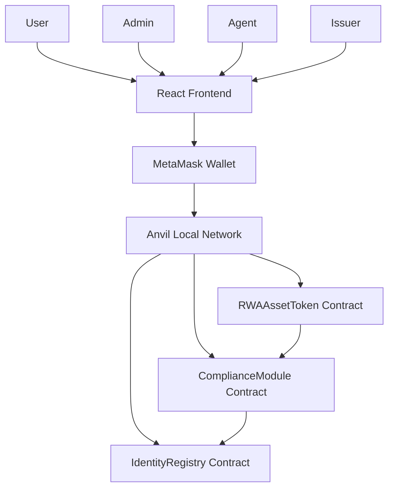

# RWA Tokenization Platform Architecture

## System Overview

The RWA (Real-World Asset) Tokenization Platform is a comprehensive blockchain-based solution for digitizing and managing real-world assets. The platform consists of smart contracts deployed on Ethereum and a React-based frontend dashboard.

## Architecture Components

### Smart Contracts Layer

#### RWAAssetToken.sol
- **Purpose**: Main ERC20 token contract representing tokenized real-world assets
- **Key Features**:
  - Compliance-integrated transfers
  - Role-based access control (Admin, Issuer, Agent)
  - Token issuance and redemption capabilities
  - Integration with compliance and identity systems

#### ComplianceModule.sol
- **Purpose**: Handles transfer compliance and regulatory restrictions
- **Key Features**:
  - Geographic transfer restrictions
  - Accredited investor requirements
  - Configurable compliance rules
  - Real-time transfer validation

#### IdentityRegistry.sol
- **Purpose**: Manages user identity verification and KYC data
- **Key Features**:
  - Identity registration and verification
  - Country and accreditation status tracking
  - Agent-controlled verification process
  - Privacy-compliant data storage

### Frontend Layer

#### React Application
- **Framework**: React 18 with Vite
- **Styling**: Tailwind CSS for responsive design
- **Blockchain Integration**: ethers.js v6 for Ethereum interaction
- **State Management**: React Context for wallet state
- **Routing**: React Router for navigation

#### Key Components
- **ConnectWallet**: Handles MetaMask integration
- **InvestorDashboard**: Main user interface for token operations
- **AdminPanel**: Administrative controls for platform management

## Data Flow Architecture

## Role-Based Access Control

### Admin Role
- **Permissions**: Full system control
- **Capabilities**:
  - Grant/revoke all roles
  - Set compliance rules
  - Emergency controls
  - System configuration

### Issuer Role
- **Permissions**: Token lifecycle management
- **Capabilities**:
  - Issue new tokens
  - Redeem existing tokens
  - Manage token supply

### Agent Role
- **Permissions**: Identity verification
- **Capabilities**:
  - Register user identities
  - Verify KYC status
  - Update user profiles

## Security Architecture

### Smart Contract Security
- **Access Control**: OpenZeppelin's AccessControl for role management
- **Reentrancy Protection**: ReentrancyGuard for critical functions
- **Input Validation**: Comprehensive parameter checking
- **Event Logging**: Complete audit trail through events

### Frontend Security
- **Wallet Integration**: Secure MetaMask connection handling
- **Input Sanitization**: Client-side validation for all forms
- **Error Handling**: Graceful error management and user feedback
- **Permission Checks**: UI restrictions based on user roles

## Compliance Framework

### Transfer Restrictions
- **Geographic**: Country-based transfer controls
- **Investor Status**: Accredited investor requirements
- **Identity Verification**: KYC completion requirements
- **Custom Rules**: Configurable compliance policies

### Regulatory Compliance
- **KYC/AML**: Identity verification and monitoring
- **Audit Trail**: Complete transaction history
- **Reporting**: Compliance reporting capabilities
- **Privacy**: GDPR-compliant data handling

## Scalability Considerations

### Smart Contract Scalability
- **Gas Optimization**: Efficient contract design
- **Upgradeability**: Proxy pattern support (future enhancement)
- **Batch Operations**: Multiple operations in single transaction
- **Event Indexing**: Efficient data retrieval

### Frontend Scalability
- **Component Architecture**: Modular, reusable components
- **State Management**: Efficient React Context usage
- **Code Splitting**: Lazy loading for large applications
- **Caching**: Smart contract data caching

## Deployment Architecture

### Development Environment
- **Blockchain**: Anvil local development network
- **Smart Contracts**: Foundry framework
- **Frontend**: Vite development server
- **Testing**: Comprehensive test suites

### Production Considerations
- **Blockchain**: Ethereum mainnet or Layer 2 solutions
- **Infrastructure**: Cloud-based deployment
- **Monitoring**: Real-time system monitoring
- **Backup**: Regular data backups and disaster recovery

## Integration Points

### External Integrations
- **Identity Providers**: KYC/AML service providers
- **Asset Oracles**: Real-world asset valuation
- **Compliance Services**: Regulatory compliance APIs
- **Banking Systems**: Traditional finance integration

### API Endpoints
- **Blockchain RPC**: Ethereum node communication
- **MetaMask API**: Wallet integration
- **IPFS (Future)**: Decentralized metadata storage
- **Analytics APIs**: Platform usage analytics

## Future Enhancements

### Planned Features
- **Multi-asset Support**: Support for different asset types
- **Automated Compliance**: AI-powered compliance checking
- **Cross-chain Support**: Multi-blockchain compatibility
- **Mobile Application**: Native mobile app development

### Technical Improvements
- **Layer 2 Integration**: Polygon or Arbitrum support
- **Advanced Governance**: DAO-based platform governance
- **Enhanced Privacy**: Zero-knowledge proof integration
- **Oracle Integration**: Real-world data feeds

## Monitoring and Analytics

### Smart Contract Monitoring
- **Transaction Monitoring**: Real-time transaction tracking
- **Gas Usage**: Optimization and monitoring
- **Error Tracking**: Failed transaction analysis
- **Performance Metrics**: Contract performance monitoring

### Frontend Analytics
- **User Engagement**: Platform usage analytics
- **Error Tracking**: Client-side error monitoring
- **Performance**: Load time and responsiveness metrics
- **Security Events**: Suspicious activity detection
